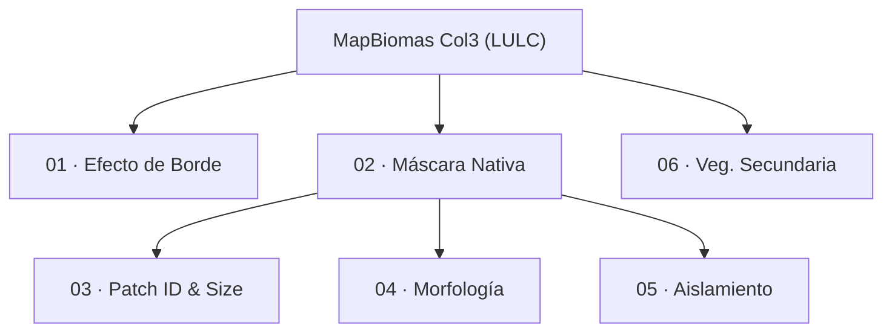

# MapBiomas Colombia — Módulo de Degradación
**Colección 3 · Años 1985–2024**

*[English version](README.md)*

| | |
|---|---|
| **Proyecto GEE** | `mapbiomas-colombia` |
| **Proyecto GCS** | `cloud-ee-lmedinaj` |
| **Bucket GCS** | `gs://mbcolombia-degradacion/AUXILIARES/DEGRADACION/COL_3/` |
| **Raíz de assets GEE** | `projects/mapbiomas-colombia/assets/DEGRADACION/COLECCION1/BETA/PROCESS/` |
| **Imagen Docker** | `degradacion-r-steps:latest` |
| **Vector de regiones** | `./gis/region_vector_buffer.geojson` (campo `id_regionC`, 155 regiones) |

Este README explica **cómo correr cada script** del módulo. Para el detalle
completo de la parte Docker (build de la imagen, service account, watchdog de
disco, RStudio interactivo) ver [`docker/README.md`](docker/README.md).

---

## Flujo



---

## Dos entornos de ejecución

El módulo alterna entre dos entornos según el paso:

| Entorno | Scripts | Cómo se corren |
|---|---|---|
| **GEE Code Editor** (`.js`) | `01A, 01B, 02A, 02B, 03C, 04C, 05A–05D, 06` | Pegar el contenido del archivo en [code.earthengine.google.com](https://code.earthengine.google.com/), ajustar los parámetros al inicio del script, click **Run**, y para las exportaciones ir a la pestaña **Tasks** y correr cada `Export.image.toAsset(...)` generado |
| **Docker (GRASS + R)** (`.R`) | `03A, 03B, 04A, 04B` | `docker run` montando el repo como volumen — ver "Docker — setup rápido" más abajo |

---

## Docker — setup rápido

Antes que nada: **abrir una terminal DENTRO de la carpeta `colombia-degradation/`**
(la que tiene este archivo, `docker/`, `scripts/`, etc.) — todos los comandos de
abajo se corren desde ahí. Colocar el service account key una vez (ver
la sección "1. Service account" de `docker/README.md`) como
`colombia-degradation/key.json` (no commitear).

Cada bloque de comandos de este README tiene dos versiones — copiar y pegar
la que corresponda a tu sistema, **sin mezclar las dos**:

- **Mac / Linux / WSL2** → terminal normal (bash/zsh)
- **Windows** → PowerShell (la terminal que abre por defecto en Windows;
  **no funciona en el `cmd.exe` viejo**)

Construir la imagen (una vez; tarda varios minutos la primera vez):

Mac / Linux / WSL2:
```bash
docker build -t degradacion-r-steps docker/grass-r 2>&1 | tee docker/build.log
```

Windows (PowerShell):
```powershell
docker build -t degradacion-r-steps docker/grass-r 2>&1 | tee docker/build.log
```
(este comando es idéntico en los dos — `tee` funciona igual en PowerShell)

> ⚠️ En los pasos de abajo, la única diferencia entre Mac/Linux y Windows es
> `"$(pwd)":/work` (Mac/Linux) vs `"${PWD}:/work"` (Windows). Usar el comando
> del sistema equivocado produce el error `docker: invalid reference format`.

---

## 🖥️ Alternativa sin terminal: workflow completo desde RStudio

**Para quien prefiere no lidiar con `docker run`, PowerShell, ni `$(pwd)` vs
`${PWD}`**: los cuatro scripts `.R` (03A, 03B, 04A, 04B) se pueden correr
enteros desde una interfaz gráfica en el navegador, sin escribir un solo
comando Docker después de este paso. Recomendado si el problema es justo la
terminal (errores de carpeta, `invalid reference format`, CLI de `gcloud`
sin instalar, etc.) — RStudio evita todo eso de una.

(requiere haber hecho el `docker build` del paso anterior — si ese comando
ya se corrió, no hace falta repetirlo)

1. Levantar el contenedor de RStudio — copiar el comando tal cual, sin
   cambiar nada (`mb-degradacion` ya es la contraseña, no hace falta
   editarla). Este comando abre el navegador solo, apenas el servidor está
   listo:

   Mac / Linux / WSL2:
   ```bash
   (sleep 3 && (open http://localhost:8787 || xdg-open http://localhost:8787)) &
   docker run --rm --name rstudio_colombia -p 8787:8787 -e PASSWORD=mb-degradacion \
     -v "$(pwd)":/home/rstudio/work --entrypoint /init degradacion-r-steps
   ```
   Windows (PowerShell):
   ```powershell
   Start-Job { Start-Sleep -Seconds 3; Start-Process http://localhost:8787 } | Out-Null
   docker run --rm --name rstudio_colombia -p 8787:8787 -e PASSWORD=mb-degradacion -v "${PWD}:/home/rstudio/work" --entrypoint /init degradacion-r-steps
   ```
2. Si el navegador no abre solo, esperar unos segundos y entrar manualmente
   a `http://localhost:8787`. Iniciar sesión con:
   - **Usuario:** `rstudio`
   - **Contraseña:** `mb-degradacion`

   **Para cerrar RStudio**: cerrar esta ventana de terminal, o volver a ella
   y apretar `Ctrl+C`. Cerrar solo la pestaña del navegador **no** lo apaga
   — el navegador es apenas una ventana hacia el contenedor, que sigue
   corriendo hasta que se cierra la terminal.

   La sesión arranca directo en `~/work` (vía `Rprofile.site`); si algún
   script no encuentra `./tif/...` o `key.json`, correr `setwd("~/work")`
   una vez en la consola.
3. En el panel **Files**, `work/` es todo el proyecto montado en vivo — lo
   que se edite ahí se guarda directo en disco, sin reconstruir la imagen.
4. Para cada script: abrir el archivo → editar `years_list` /
   `region_id_default` al inicio → clic en **Source** (arriba a la derecha
   del editor), en este orden:
   - **03A** — editar `years_list` → Source → salidas en `results/03A/`
   - **03B** — editar `years_list` / `upload_outputs` → Source → sube a GCS
     e ingesta en GEE (`03_patch-id/`, `03_patch-size-all/`)
   - **04A** — editar `region_id_default` / `years_list` → Source → salidas
     en `results/04A/`
   - **04B** — mismo `region_id_default` que 04A, editar `years_list` →
     Source → ingesta en GEE (`04_morphology/`)

⚠️ Source corre todo secuencialmente en un solo proceso R — no tiene el pool
paralelo de `run_03A.sh` ni el watchdog de disco de `run_morph.sh`. Para
lotes grandes en paralelo o con watchdog, usar esos wrappers (sección
siguiente) o ver la sección "3. Workflow completo desde RStudio" de
`docker/README.md` para el detalle completo de este workflow.

---

## Cómo correr cada paso

Cada paso indica su entorno entre paréntesis. Los pasos en GEE se corren en
el Code Editor (ver tabla de arriba); 03A/03B/04A/04B usan Docker desde la
terminal — alternativa a la sección de RStudio de más arriba.

### 01 — Efecto de borde (GEE)
```
01A_fragmentation_edgeArea_v2.js   → editar params.region / years_list → Run → Tasks
01B_fragmentation_edgeAge_v2.js    → editar params.region / years → Run → Tasks
```
Salida: `01_edge_area/EDGE-AREA-RRRR-YYYY-V`, `01_edge_age/EDGE-AGE-RRRR-YYYY-V`

### 02 — Máscara nativa (GEE)
```
02A_utils_nativeMask.js       → Run → Tasks (genera native_mask/nativeMask_col3_v1)
02B_utils_exportToBucket.js   → fijar exportTarget ('gcs'/'drive') → Run → Tasks
```
`02C_utils_mosaicTIFF.ipynb` y `02D_utils_ingestTIFF.R` **no se usan** en
Colombia (un TIF/año ya sale de 02B; 03A lee directo de GCS).

### 03 — Patch ID & Size (Docker + GEE)

**03A — un año suelto:**

Mac / Linux / WSL2:
```bash
docker run --rm -v "$(pwd)":/work degradacion-r-steps 03A_fragmentation_id_size.R 1985
```
Windows (PowerShell):
```powershell
docker run --rm -v "${PWD}:/work" degradacion-r-steps 03A_fragmentation_id_size.R 1985
```

**03A — varios años en paralelo** (pool de contenedores, recomendado — requiere
**Mac / Linux / WSL2 / Git Bash**, no corre en PowerShell nativo):
```bash
./scripts/run_03A.sh 1985 1986 1987 1988
./scripts/run_03A.sh $(seq 1985 2024)
```

**03B — subir a GEE** (editar `years_list` / `upload_outputs` en el script primero):

Mac / Linux / WSL2:
```bash
docker run --rm -v "$(pwd)":/work degradacion-r-steps 03B_uploadToGEE.R
```
Windows (PowerShell):
```powershell
docker run --rm -v "${PWD}:/work" degradacion-r-steps 03B_uploadToGEE.R
```
```
03C_patchID_patchSize_formatAsset.js   → GEE Code Editor → Run → Tasks
```
Salidas: `results/03A/fragment_id_YYYY.tif` + `fragment_area_YYYY.tif` (local
y GCS `results_03A/`); GEE `03_patch-id/`, `03_patch-size-all/`, y tras
03C: `public/degradation_patch_id_col3_v1` / `..._patch_size_col3_v1`.

### 04 — Morfología / MSPA (Docker + GEE)

**04A — GRASS, por región** (wrapper con watchdog de disco, recomendado —
requiere **Mac / Linux / WSL2 / Git Bash**, no corre en PowerShell nativo):
```bash
./scripts/run_morph.sh 1985
./scripts/run_morph.sh 1985 1986 1987      # secuencial, misma región
```

**04A — directo, sin watchdog** (cualquier sistema, pero en Windows hay que
vigilar manualmente que `grassdata/` no crezca demasiado):

Mac / Linux / WSL2:
```bash
docker run --rm -v "$(pwd)":/work degradacion-r-steps 04A_fragmentation_morphology.R 30471 1985
```
Windows (PowerShell):
```powershell
docker run --rm -v "${PWD}:/work" degradacion-r-steps 04A_fragmentation_morphology.R 30471 1985
```

**04B — subir a GEE:**

Mac / Linux / WSL2:
```bash
docker run --rm -v "$(pwd)":/work degradacion-r-steps 04B_morphology_uploadToGEE.R
docker run --rm -v "$(pwd)":/work degradacion-r-steps 04B_morphology_uploadToGEE.R 30471 1985 1986
```
Windows (PowerShell):
```powershell
docker run --rm -v "${PWD}:/work" degradacion-r-steps 04B_morphology_uploadToGEE.R
docker run --rm -v "${PWD}:/work" degradacion-r-steps 04B_morphology_uploadToGEE.R 30471 1985 1986
```
```
04C_morphology_formatAsset.js   → GEE Code Editor → Run → Tasks
```
Editar `region_id_default` (04A) / `REGION=` (`run_morph.sh`) para procesar
otra región. Salidas: `results/04A/morphology_YYYY_RRRR.tif` (valores de
píxel 0–6 — clases MSPA, ver el encabezado de `04A_fragmentation_morphology.R`
para el significado de cada una); GEE `04_morphology/` y, tras 04C,
`public/degradation_morphology_col3_v1`.

### 05 — Aislamiento (GEE)
```
05A_fragmentation_isolation_stepA.js   → reproyecta la máscara nativa a 100 m
05B_fragmentation_isolation_stepB.js   → connectedPixelCount() = tamaño de parche
05C_fragmentation_isolation_stepC.js   → distancia euclidiana a bloques fuente
05D_fragmentation_isolation_stepD_v2.js → cruza tamaño + distancia + tamaño de fuente → código 1–10
```
Correr en orden estricto (05A → 05B → 05C → 05D), cada uno espera el asset de
salida del anterior. Salidas finales:
`public/degradation_isolation_{100,500,1000}ha_col{N}_v{V}`.

### 06 — Vegetación secundaria (GEE)
```
06_secondaryVegetation_age.js
```
Asset y códigos de clase confirmados: `asset` apunta a
`DEFORESTATION/deforestation-secondary-vegetation-ft`, `secondary_classes = [3, 5]`.

---

## Utilidades

**Borrar archivos en GCS** (con confirmación interactiva — requiere Mac /
Linux / WSL2 / Git Bash):
```bash
./scripts/gcs_delete.sh gs://mbcolombia-degradacion/AUXILIARES/DEGRADACION/COL_3/results_04A/30471/
```

---

## Estructura de archivos

```
colombia-degradation/
  key.json                          ← service account Docker (no commitear)
  gis/
    region_vector_buffer.geojson    ← 155 regiones (id_regionC)
  tif/
    nativeMask-classification_YYYY.tif   ← descargado de GCS por 03A/04A
  results/
    03A/   fragment_id_YYYY.tif · fragment_area_YYYY.tif
    04A/   morphology_YYYY_RRRR.tif
  logs/
    YYYY.log                        ← 03A (un archivo por año)
    RRRR_YYYY_morphology.log        ← 04A (región + año)
  manifests/                        ← JSONs de ingesta GEE (03B / 04B)
  grassdata/                        ← scratch de GRASS (se borra automáticamente)
  scripts/
    run_03A.sh                      ← pool paralelo para 03A (N años a la vez)
    run_morph.sh                    ← wrapper Docker + watchdog para 04A
    gcs_delete.sh                   ← utilidad para borrar archivos en GCS
  docker/
    README.md                       ← detalle completo Docker (build, service account, RStudio)
    grass-r/                        ← Dockerfile de la imagen degradacion-r-steps
  PIPELINE.md                       ← diagrama de flujo + tabla de scripts/estado
```
