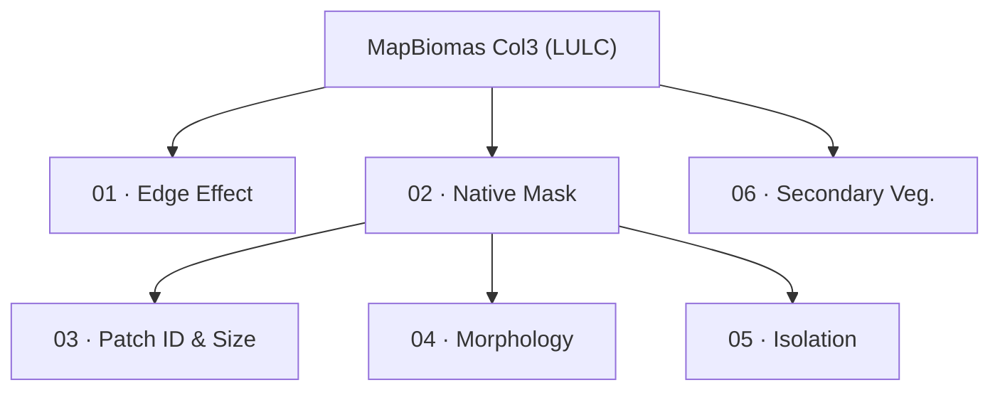

# MapBiomas Colombia — Degradation Module
**Collection 3 · Years 1985–2024**

*[Versión en español](README.es.md)*

| | |
|---|---|
| **GEE Project** | `mapbiomas-colombia` |
| **GCS Project** | `cloud-ee-lmedinaj` |
| **GCS Bucket** | `gs://mbcolombia-degradacion/AUXILIARES/DEGRADACION/COL_3/` |
| **GEE Assets Root** | `projects/mapbiomas-colombia/assets/DEGRADACION/COLECCION1/BETA/PROCESS/` |
| **Docker Image** | `degradacion-r-steps:latest` |
| **Region Vector** | `./gis/region_vector_buffer.geojson` (field `id_regionC`, 155 regions) |

This README explains **how to run each script** in the module. For full
details on the Docker side (building the image, service account, disk
watchdog, interactive RStudio) see [`docker/README.md`](docker/README.md).

---

## Flow



---

## Two execution environments

The module alternates between two environments depending on the step:

| Environment | Scripts | How to run |
|---|---|---|
| **GEE Code Editor** (`.js`) | `01A, 01B, 02A, 02B, 03C, 04C, 05A–05D, 06` | Paste the file contents into [code.earthengine.google.com](https://code.earthengine.google.com/), adjust the parameters at the top of the script, click **Run**, and for exports go to the **Tasks** tab and run each generated `Export.image.toAsset(...)` |
| **Docker (GRASS + R)** (`.R`) | `03A, 03B, 04A, 04B` | `docker run` mounting the repo as a volume — see "Docker — quick setup" below |

---

## Docker — quick setup

First: **open a terminal INSIDE the `colombia-degradation/` folder**
(the one with this file, `docker/`, `scripts/`, etc.) — all commands
below are run from there. Place the service account key once (see
the "1. Service account" section of `docker/README.md`) as
`colombia-degradation/key.json` (do not commit).

Every command block in this README has two versions — copy and paste
the one for your system, **without mixing the two**:

- **Mac / Linux / WSL2** → normal terminal (bash/zsh)
- **Windows** → PowerShell (the terminal that opens by default on Windows;
  **does not work in the old `cmd.exe`**)

Build the image (once; takes several minutes the first time):

Mac / Linux / WSL2:
```bash
docker build -t degradacion-r-steps docker/grass-r 2>&1 | tee docker/build.log
```

Windows (PowerShell):
```powershell
docker build -t degradacion-r-steps docker/grass-r 2>&1 | tee docker/build.log
```
(this command is identical on both — `tee` works the same in PowerShell)

> ⚠️ In the steps below, the only difference between Mac/Linux and Windows is
> `"$(pwd)":/work` (Mac/Linux) vs `"${PWD}:/work"` (Windows). Using the wrong
> system's command produces the error `docker: invalid reference format`.

---

## 🖥️ Terminal-free alternative: full workflow from RStudio

**For those who prefer not to deal with `docker run`, PowerShell, or `$(pwd)`
vs `${PWD}`**: the four `.R` scripts (03A, 03B, 04A, 04B) can be run
entirely from a browser-based GUI, without typing a single Docker command
after this step. Recommended if the terminal itself is the problem (folder
errors, `invalid reference format`, `gcloud` CLI not installed, etc.) —
RStudio avoids all of that at once.

(requires having done the `docker build` from the previous step — if that
command already ran, no need to repeat it)

1. Start the RStudio container — copy the command as-is, without
   changing anything (`mb-degradacion` is already the password, no need
   to edit it). This command opens the browser on its own, as soon as the
   server is ready:

   Mac / Linux / WSL2:
   ```bash
   (sleep 3 && (open http://localhost:8787 || xdg-open http://localhost:8787)) &
   docker run --rm --name rstudio_colombia -p 8787:8787 -e PASSWORD=mb-degradacion \
     -v "$(pwd)":/home/rstudio/work --entrypoint /init degradacion-r-steps
   ```
   Windows (PowerShell):
   ```powershell
   Start-Job { Start-Sleep -Seconds 3; Start-Process http://localhost:8787 } | Out-Null
   docker run --rm --name rstudio_colombia -p 8787:8787 -e PASSWORD=mb-degradacion -v "${PWD}:/home/rstudio/work" --entrypoint /init degradacion-r-steps
   ```
2. If the browser doesn't open on its own, wait a few seconds and go to
   `http://localhost:8787` manually. Log in with:
   - **User:** `rstudio`
   - **Password:** `mb-degradacion`

   **To close RStudio**: close this terminal window, or go back to it
   and press `Ctrl+C`. Closing just the browser tab **does not** shut it
   down — the browser is just a window into the container, which keeps
   running until the terminal is closed.

   The session starts directly in `~/work` (via `Rprofile.site`); if a
   script can't find `./tif/...` or `key.json`, run `setwd("~/work")`
   once in the console.
3. In the **Files** panel, `work/` is the whole project mounted live —
   whatever you edit there is saved directly to disk, no need to rebuild
   the image.
4. For each script: open the file → edit `years_list` /
   `region_id_default` at the top → click **Source** (top right of the
   editor), in this order:
   - **03A** — edit `years_list` → Source → output in `results/03A/`
   - **03B** — edit `years_list` / `upload_outputs` → Source → uploads to
     GCS and ingests into GEE (`03_patch-id/`, `03_patch-size-all/`)
   - **04A** — edit `region_id_default` / `years_list` → Source → output
     in `results/04A/`
   - **04B** — same `region_id_default` as 04A, edit `years_list` →
     Source → ingests into GEE (`04_morphology/`)

⚠️ Source runs everything sequentially in a single R process — it doesn't
have the parallel pool from `run_03A.sh` nor the disk watchdog from
`run_morph.sh`. For large parallel batches or with watchdog, use those
wrappers (next section) or see the "3. RStudio workflow" section of
`docker/README.md` for the full detail of this workflow.

---

## How to run each step

Each step indicates its environment in parentheses. GEE steps run in
the Code Editor (see table above); 03A/03B/04A/04B use Docker from the
terminal — an alternative to the RStudio section above.

### 01 — Edge effect (GEE)
```
01A_fragmentation_edgeArea_v2.js   → edit params.region / years_list → Run → Tasks
01B_fragmentation_edgeAge_v2.js    → edit params.region / years → Run → Tasks
```
Output: `01_edge_area/EDGE-AREA-RRRR-YYYY-V`, `01_edge_age/EDGE-AGE-RRRR-YYYY-V`

### 02 — Native mask (GEE)
```
02A_utils_nativeMask.js       → Run → Tasks (generates native_mask/nativeMask_col3_v1)
02B_utils_exportToBucket.js   → set exportTarget ('gcs'/'drive') → Run → Tasks
```
`02C_utils_mosaicTIFF.ipynb` and `02D_utils_ingestTIFF.R` **are not used**
for Colombia (one TIF/year already comes out of 02B; 03A reads directly
from GCS).

### 03 — Patch ID & Size (Docker + GEE)

**03A — a single year:**

Mac / Linux / WSL2:
```bash
docker run --rm -v "$(pwd)":/work degradacion-r-steps 03A_fragmentation_id_size.R 1985
```
Windows (PowerShell):
```powershell
docker run --rm -v "${PWD}:/work" degradacion-r-steps 03A_fragmentation_id_size.R 1985
```

**03A — several years in parallel** (container pool, recommended — requires
**Mac / Linux / WSL2 / Git Bash**, does not run in native PowerShell):
```bash
./scripts/run_03A.sh 1985 1986 1987 1988
./scripts/run_03A.sh $(seq 1985 2024)
```

**03B — upload to GEE** (edit `years_list` / `upload_outputs` in the script first):

Mac / Linux / WSL2:
```bash
docker run --rm -v "$(pwd)":/work degradacion-r-steps 03B_uploadToGEE.R
```
Windows (PowerShell):
```powershell
docker run --rm -v "${PWD}:/work" degradacion-r-steps 03B_uploadToGEE.R
```
```
03C_patchID_patchSize_formatAsset.js   → GEE Code Editor → Run → Tasks
```
Output: `results/03A/fragment_id_YYYY.tif` + `fragment_area_YYYY.tif` (local
and GCS `results_03A/`); GEE `03_patch-id/`, `03_patch-size-all/`, and after
03C: `public/degradation_patch_id_col3_v1` / `..._patch_size_col3_v1`.

### 04 — Morphology / MSPA (Docker + GEE)

**04A — GRASS, per region** (wrapper with disk watchdog, recommended —
requires **Mac / Linux / WSL2 / Git Bash**, does not run in native PowerShell):
```bash
./scripts/run_morph.sh 1985
./scripts/run_morph.sh 1985 1986 1987      # sequential, same region
```

**04A — direct, no watchdog** (any system, but on Windows you have to
manually watch that `grassdata/` doesn't grow too large):

Mac / Linux / WSL2:
```bash
docker run --rm -v "$(pwd)":/work degradacion-r-steps 04A_fragmentation_morphology.R 30471 1985
```
Windows (PowerShell):
```powershell
docker run --rm -v "${PWD}:/work" degradacion-r-steps 04A_fragmentation_morphology.R 30471 1985
```

**04B — upload to GEE:**

Mac / Linux / WSL2:
```bash
docker run --rm -v "$(pwd)":/work degradacion-r-steps 04B_morphology_uploadToGEE.R
docker run --rm -v "$(pwd)":/work degradacion-r-steps 04B_morphology_uploadToGEE.R 30471 1985 1986
```
Windows (PowerShell):
```powershell
docker run --rm -v "${PWD}:/work" degradacion-r-steps 04B_morphology_uploadToGEE.R
docker run --rm -v "${PWD}:/work" degradacion-r-steps 04B_morphology_uploadToGEE.R 30471 1985 1986
```
```
04C_morphology_formatAsset.js   → GEE Code Editor → Run → Tasks
```
Edit `region_id_default` (04A) / `REGION=` (`run_morph.sh`) to process
another region. Output: `results/04A/morphology_YYYY_RRRR.tif` (pixel
values 0–6 — MSPA classes, see the header of
`04A_fragmentation_morphology.R` for the meaning of each one); GEE
`04_morphology/` and, after 04C, `public/degradation_morphology_col3_v1`.

### 05 — Isolation (GEE)
```
05A_fragmentation_isolation_stepA.js   → reprojects the native mask to 100 m
05B_fragmentation_isolation_stepB.js   → connectedPixelCount() = patch size
05C_fragmentation_isolation_stepC.js   → Euclidean distance to source blocks
05D_fragmentation_isolation_stepD_v2.js → combines size + distance + source size → code 1–10
```
Run in strict order (05A → 05B → 05C → 05D), each one waits for the
output asset of the previous one. Final outputs:
`public/degradation_isolation_{100,500,1000}ha_col{N}_v{V}`.

### 06 — Secondary vegetation (GEE)
```
06_secondaryVegetation_age.js
```
Asset and class codes confirmed: `asset` points to
`DEFORESTATION/deforestation-secondary-vegetation-ft`, `secondary_classes = [3, 5]`.

---

## Utilities

**Delete files on GCS** (with interactive confirmation — requires Mac /
Linux / WSL2 / Git Bash):
```bash
./scripts/gcs_delete.sh gs://mbcolombia-degradacion/AUXILIARES/DEGRADACION/COL_3/results_04A/30471/
```

---

## File structure

```
colombia-degradation/
  key.json                          ← Docker service account (do not commit)
  gis/
    region_vector_buffer.geojson    ← 155 regions (id_regionC)
  tif/
    nativeMask-classification_YYYY.tif   ← downloaded from GCS by 03A/04A
  results/
    03A/   fragment_id_YYYY.tif · fragment_area_YYYY.tif
    04A/   morphology_YYYY_RRRR.tif
  logs/
    YYYY.log                        ← 03A (one file per year)
    RRRR_YYYY_morphology.log        ← 04A (region + year)
  manifests/                        ← GEE ingestion JSONs (03B / 04B)
  grassdata/                        ← GRASS scratch space (deleted automatically)
  scripts/
    run_03A.sh                      ← parallel pool for 03A (N years at a time)
    run_morph.sh                    ← Docker wrapper + watchdog for 04A
    gcs_delete.sh                   ← utility to delete files on GCS
  docker/
    README.md                       ← full Docker details (build, service account, RStudio)
    grass-r/                        ← Dockerfile for the degradacion-r-steps image
  PIPELINE.md                       ← flow diagram + script/status table
```
